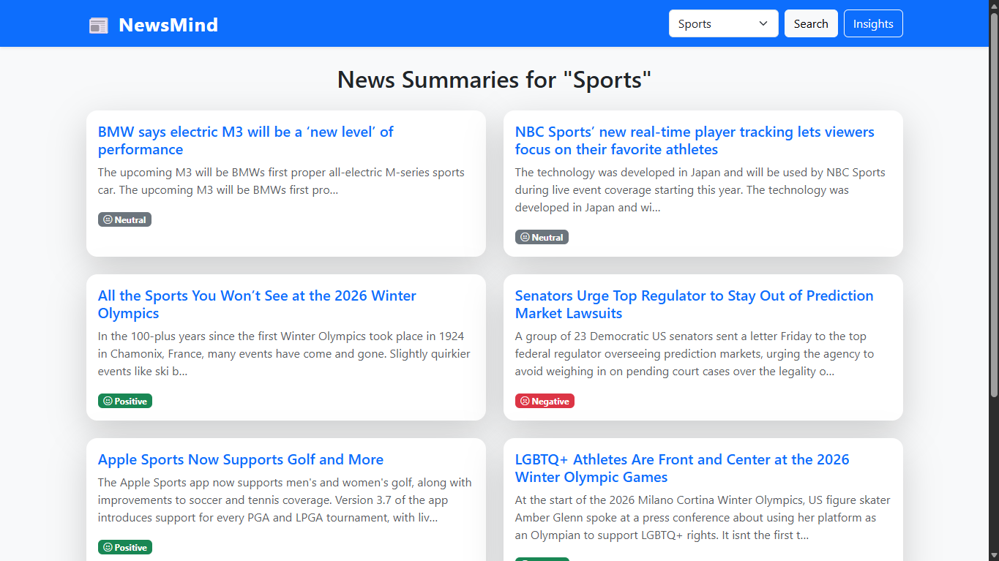
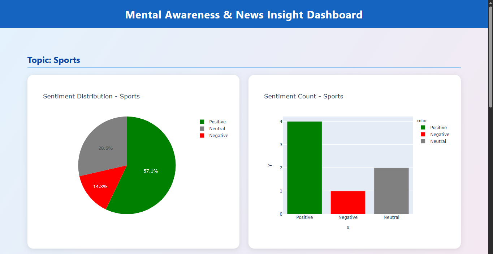
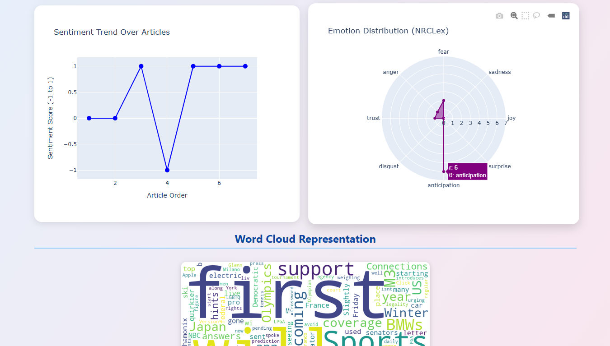
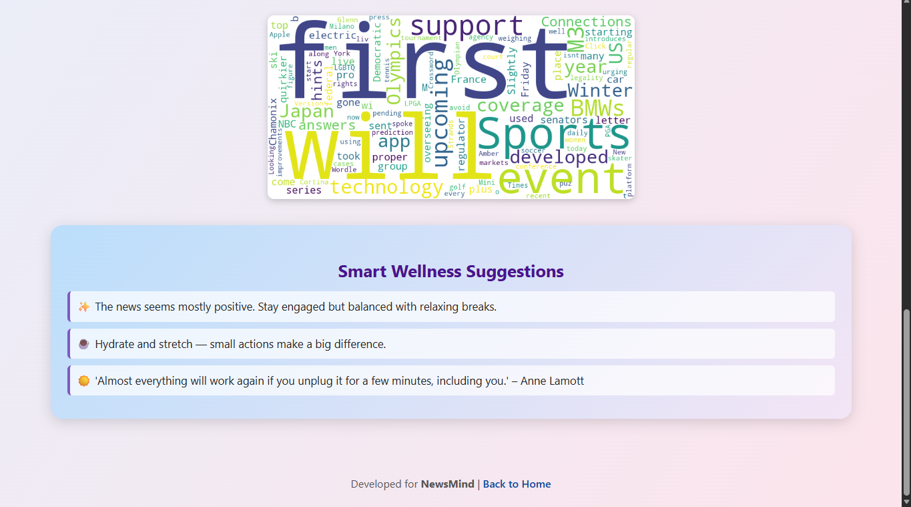

# NewsMind: NLP-based News Summarizer & Sentiment Tracker for Mental Health Awareness 

## Overview
**NewsMind** is an intelligent web-based application that combines **Natural Language Processing (NLP)**, **Sentiment Analysis**, and **Emotion Detection** to provide emotionally aware news summaries.  
It enables users to stay informed while remaining conscious of their **mental well-being** by analyzing the emotional tone of daily news consumption.

The system automatically:
- Fetches **real-time news** from APIs  
- Generates **concise summaries** using NLP  
- Performs **sentiment classification** (Positive / Negative / Neutral)  
- Detects **emotional tones** (Joy, Fear, Sadness, etc.)  
- Visualizes results using **interactive dashboards** (Pie, Bar, Radar, and Word Cloud)  
- Provides **awareness suggestions** based on emotional trends  

---

## System Architecture
The project consists of three major modules:
1. **Data Fetching Module** — Uses API to retrieve real-time news articles  
2. **Processing Module** — Handles text cleaning, summarization, sentiment analysis, and emotion detection  
3. **Insights Module** — Displays sentiment and emotion visualizations with mental wellness suggestions  

---

## Technology Stack

| Category | Tools / Libraries |
|---------|------------------|
| **Programming Language** | Python 3.x |
| **Framework** | Flask |
| **Frontend** | HTML, CSS, Bootstrap |
| **NLP Libraries** | NLTK, VADER, NRCLex |
| **Visualization** | Plotly, WordCloud |
| **Data Handling** | Pandas, Requests |
| **Environment** | Virtual Environment (venv) |

---

## Folder Structure
Got it 👍
Below is the **clean, professional, copy-paste ready UPDATED `README.md` markdown code** with **proper screenshot section, captions, and GitHub-standard formatting**.

You can **directly replace your existing README.md** with this or merge it safely.

---

```md
# NewsMind: NLP-based News Summarizer & Sentiment Tracker for Mental Health Awareness 

## Overview
**NewsMind** is an intelligent web-based application that combines **Natural Language Processing (NLP)**, **Sentiment Analysis**, and **Emotion Detection** to provide emotionally aware news summaries.  
It enables users to stay informed while remaining conscious of their **mental well-being** by analyzing the emotional tone of daily news consumption.

The system automatically:
- Fetches **real-time news** from APIs  
- Generates **concise summaries** using NLP  
- Performs **sentiment classification** (Positive / Negative / Neutral)  
- Detects **emotional tones** (Joy, Fear, Sadness, etc.)  
- Visualizes results using **interactive dashboards** (Pie, Bar, Radar, and Word Cloud)  
- Provides **awareness suggestions** based on emotional trends  

---

## System Architecture
The project consists of three major modules:
1. **Data Fetching Module** — Uses API to retrieve real-time news articles  
2. **Processing Module** — Handles text cleaning, summarization, sentiment analysis, and emotion detection  
3. **Insights Module** — Displays sentiment and emotion visualizations with mental wellness suggestions  

---

## Technology Stack

| Category | Tools / Libraries |
|---------|------------------|
| **Programming Language** | Python 3.x |
| **Framework** | Flask |
| **Frontend** | HTML, CSS, Bootstrap |
| **NLP Libraries** | NLTK, VADER, NRCLex |
| **Visualization** | Plotly, WordCloud |
| **Data Handling** | Pandas, Requests |
| **Environment** | Virtual Environment (venv) |

---

## Folder Structure

NewsMind/
│
├── app/
│   ├── **init**.py
│   ├── news_fetcher.py       → Fetches real-time news via API
│   ├── summarizer.py         → Handles extractive summarization
│   ├── sentiment.py          → Performs VADER sentiment analysis
│
├── static/
│   ├── style.css             → Styling for frontend
│
├── templates/
│   ├── index.html            → Homepage with topic search and summaries
│   ├── insights.html         → Dashboard with emotion/sentiment charts
│
├── screenshots/              → Project UI screenshots
│   ├── sports_news_cards.png
│   ├── sentiment_dashboard.png
│   ├── emotion_wordcloud.png
│   ├── wellness_suggestions.png
│
├── main.py                   → Flask entry point
├── requirements.txt          → List of dependencies
├── README.md                 → Project documentation
└── venv/                     → Virtual environment (optional)

````

---

## Setup and Execution Steps

### 1. Create and Activate Virtual Environment
```bash
python -m venv venv

# Windows
venv\Scripts\activate

# macOS / Linux
source venv/bin/activate
````

---

### 2. Install Dependencies

```bash
pip install -r requirements.txt
```

---

### 3. Run the Application

```bash
python main.py
```

Open your browser and visit:

```
http://127.0.0.1:5000/
```

---

## Usage Instructions

### Step 1 — Search for News

* Enter a keyword/topic (e.g., *Sports*, *Technology*, *Health*)
* Click **Search** to fetch real-time news

### Step 2 — Summarization & Sentiment Analysis

* News articles are summarized automatically
* Sentiment classified as **Positive / Neutral / Negative**

### Step 3 — Insights Dashboard

Interactive visualizations include:

* Pie Chart — Sentiment distribution
* Bar Chart — Sentiment counts
* Radar Chart — Emotion distribution (NRCLex)
* Word Cloud — Dominant keywords

### Step 4 — Wellness Suggestions

Emotion-aware prompts promote **balanced and mindful news consumption**.

---

## 📸 Application Screenshots

### 📰 News Fetching & Summarization

<p align="center">
  
</p>
<p align="center">
  <em>Figure 1: Topic-based sports news retrieval with concise summaries and sentiment classification.</em>
</p>

---

### 📊 Sentiment Analysis Dashboard

<p align="center">
  
</p>
<p align="center">
  <em>Figure 2: Interactive dashboard visualizing sentiment distribution, sentiment counts, and sentiment trends.</em>
</p>

---

### 🧠 Emotion Detection & Word Cloud

<p align="center">
  
</p>
<p align="center">
  <em>Figure 3: Emotion radar chart using NRCLex combined with a word cloud highlighting dominant emotional keywords.</em>
</p>

---

### 🌱 Smart Wellness Suggestions

<p align="center">
  
</p>
<p align="center">
  <em>Figure 4: Emotion-aware wellness suggestions generated based on overall sentiment trends.</em>
</p>

---

## Key Features

* Real-time news fetching
* NLP-based extractive summarization
* Sentiment and emotion detection
* Interactive Plotly visualizations
* Dynamic word cloud generation
* Mental wellness–oriented awareness prompts

---

## Dependencies

* Python ≥ 3.8
* Flask ≥ 2.0
* NLTK ≥ 3.8
* VADER Sentiment ≥ 3.3
* NRCLex ≥ 3.0
* WordCloud ≥ 1.8
* Plotly ≥ 5.0
* Pandas ≥ 2.0
* Requests ≥ 2.28

---

## Future Enhancements

* Transformer-based summarization (BART / T5)
* Multi-language news analysis
* Sentiment timeline tracking
* Mobile-responsive UI
* Personalized mental wellness insights

---

## Developed By

**Narmadha R. M.**
Vellore Institute of Technology, Vellore, India


